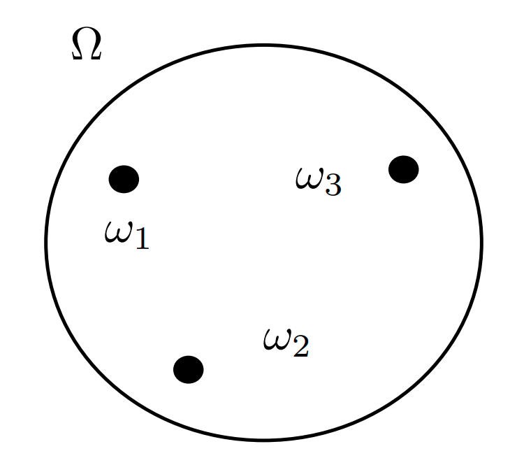

```{r setup, include=FALSE}
knitr::opts_chunk$set(echo = TRUE)
```

# Sample Space



# Event Space


# Probability Measure and Probability Space


# Random Variable


# Probability Distribution


# Markov Transition Kernel


