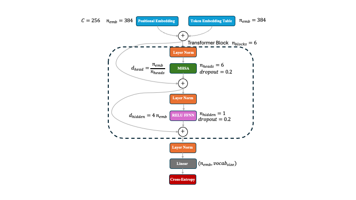

The aim of this project is to write from scratch and test various model design choices for LLMs. My application will be [DanteGPT](https://github.com/MauroCE/DanteGPT), i.e. creating a chatbot that generates text similar to Dante Alighieri's "Divina Commedia". I want to test both training speed, validation/test loss and ease of use/tuning. I am running all examples on a MacBook Pro M3 with 11 cores.

# Model 1
My first model is very similar to Andrej Karapathy's NanoGPT, which is itself very much inspired by the architecture of GPT2, with some refinements. The full model is described in the GitHub repo, but here is a diagram explain the main features.

# Going Forward
There are several design choices that would be more modern, and I plan to explore these in the next few weeks. 

